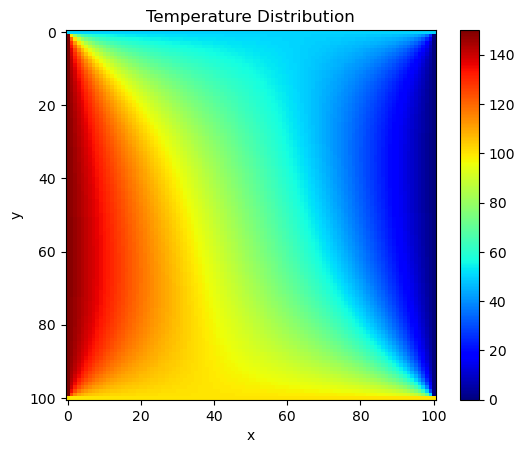
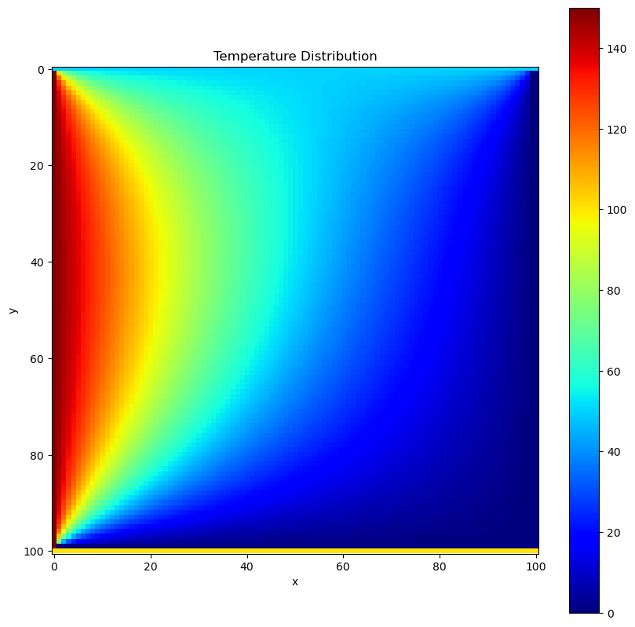

# Numerical_Method_solving_laplace_equations
Compare numerical methods to solve given Laplace equation.

# Problem Given
Our final project problem was given as follows:

**Solving 2D steady state heat equation on uniform Cartesian grid**

Equation:

$$ \nabla^{2} T = 0 \\; \text{where} \\; T(x,y) $$

Boundary Conditions:

$$ T(0,y) = 150 (K) \\; \text{for} \\; 0 \leq y \leq 1 $$
$$ T(1,y) = 0 (K) \\; \text{for} \\; 0 \leq y \leq 1 $$
$$ T(x,1) = 50 (K) \\; \text{for} \\; 0 \leq x \leq 1 $$
$$ T(x,0) = 100 (K) \\; \text{for} \\; 0 \leq x \leq 1 $$

**Find the steady state temperature distribution $T(x,y)$ on the plate by using:**

1. Jacobi scheme
2. SOR scheme
3. Gauss-Seidel scheme

Then provide discussion on; (1)**Physical interpretation of $T(x,y)$**, (2) Comparison of the results obtained from 1.-3. above in terms of **computational time**(relative to Jacobi) as well as the trend in the temperature field.

# Background
Our problem is 2D [laplace equation](https://en.wikipedia.org/wiki/Laplace%27s_equation). So that, we can express the problem as follows:

$$ \frac{\partial^{2} \varphi}{\partial x^{2}} + \frac{\partial^{2} \varPhi}{\partial y^{2}} = 0 $$

$$ \text{on} \\; 0 \leq x \leq 1, \\; 0 \leq y \leq 1 $$

with $\varphi = f(x,y)$ on $\partial D$

Each second derivative can approximate to center differencing approximation:

$$\frac{d^{2} f}{d x^{2}} \approx \frac{f_{i-1} - 2f_{i} + f_{i+1}}{\Delta x^{2}}$$

So, our equation can be written as follows:

$$ \frac{\varphi_{i-1,j} - 2 \varphi_{i,j} + \varphi_{i+1,j}}{\Delta x^{2}} + \frac{\varphi_{i,j-1} - 2 \varphi_{i,j} + \varphi_{i,j+1}}{\Delta y^{2}} = 0 $$

Rewrite this equation with assuming $\frac{\Delta x}{\Delta y} = 1$, then

$$ \varphi_{i+1,j} + \varphi_{i-1,j} + \varphi_{i,j+1} + \varphi_{i,j-1} - 4 \varphi_{i,j} = 0 $$

we can obatin this linear equation. This is the main equation to solve the laplace equation numerically.

# Solving Approach
## Jacobi scheme
Jacobi scheme is that update the next time step from the current step using following formula.

$$ \varphi_{i,j}^{n+1} = \frac{1}{4} \left( \varphi_{i-1,j} + \varphi_{i+1,j} + \varphi_{i,j-1} + \varphi_{i,j+1} \right) $$

Jacobi scheme is the one of the *explicit* method.

The result of Jacobi method is shown in [Fig. 1.](#fig1)

Fig 1. Temperature distribution using **Jacobi** scheme

## Gauss-Seidel scheme
Gauss-Seidel method is that update the next step using both next step and current step. The fomula is as follows:

$$ \varphi_{i,j}^{n+1} = \frac{1}{4} \left( \varphi_{i+1,j}^{n} + \textcolor{red}{\varphi_{i-1,j}^{n+1}} + \varphi_{i,j+1}^{n} + \textcolor{red}{\varphi_{i,j-1}^{n+1}} \right) $$

Gauss-Seidel method is *implicit* method.

The result of Gauss-Seidel method is shown in [Fig. 2.](#fig2)

Fig 2. Temperature distribution using **Gauss-Seidel** scheme

Both **Jacobi** and **Gauss-Seidel** scheme is looping until the difference of current steps and next steps become lower than tolerance with $10^{-6}$.

## SOR scheme
**SOR(Successive OverRelaxation)** method is advanced method of [Gauss-Seidel method](#gauss-seidel-scheme). The formula is given by:

$$
\begin{align*}
\varphi_{i,j}^{n+1} &= \varphi_{i,j}^{n} + \omega \left[ \frac{1}{4} \left( \varphi_{i+1,j}^{n} + \varphi_{i-1,j}^{n+1} + \varphi_{i,j+1}^{n} + \varphi_{i,j-1}^{n+1} \right) - \varphi_{i,j}^{n} \right] \\
&= \frac{\omega}{4} \left( \varphi_{i+1,j}^{n} + \varphi_{i-1,j}^{n+1} + \varphi_{i,j+1}^{n} + \varphi_{i,j-1}^{n+1} \right) + ( 1 - \omega ) \varphi_{i,j}^{n}
\end{align*}
$$

In this formula, $\omega$ is referred to as the **relaxation factor**.
When $0 < \omega < 1$, it is *under-relaxation* and when $1 < \omega < 2$, it is *over-relaxation*. When you want to accelerate the speed of convergence, you can use *over-relaxaion*. Or use *under-relaxation* for decreasing converegence. You can adjust the relaxation factor during running method.

The best value of relaxation factor cannot be determined easily, but people usually use $\omega = 1.753$.

In this project, I used a relaxation factor $\omega$ of $\frac{2}{1 + \sin (\pi h)}$ for over-relaxation where $h=1/(N+1)$ on the grid $N \times N$ when error is higher than $10^{-3}$, and $0.7$ for under-relaxation when error is lower than $10^{-3}$.

The result of **SOR method** is shown in [Fig. 3](#fig3).

Fig 3. Temperature distribution using **SOR** scheme.

